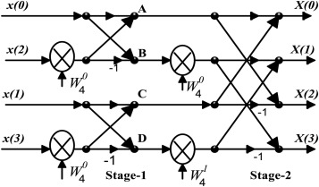
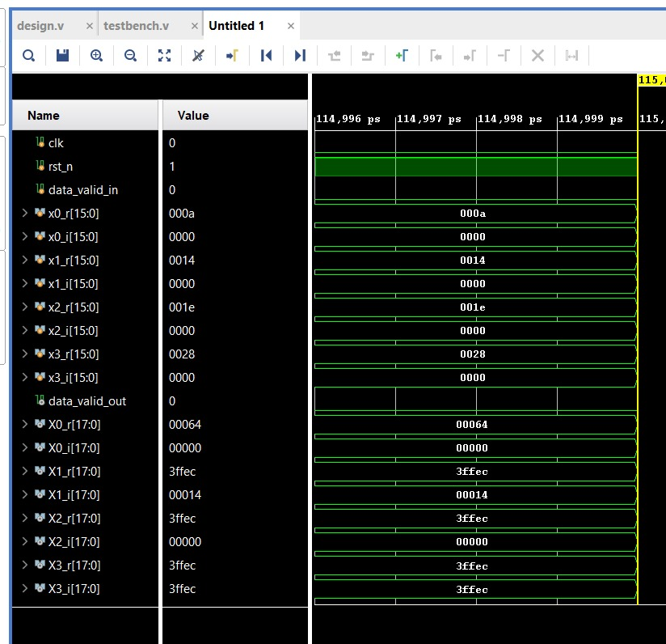
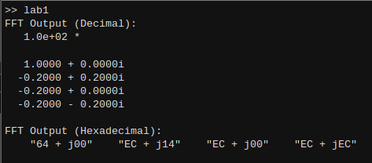
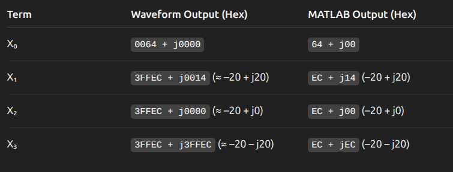
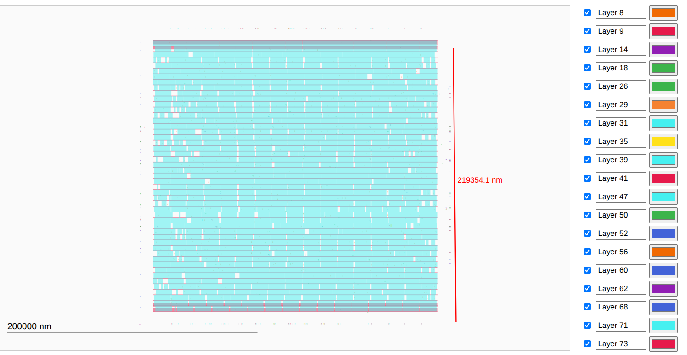

# 4-Point 2-Stage Pipelined FFT Processor (RTL-to-GDSII)

This project demonstrates the **complete semi-custom VLSI design flow** of a 4-point Fast Fourier Transform (FFT) processor — from **RTL design in Verilog** to **final GDSII layout generation**.  
The design was synthesized using **Cadence Genus** and implemented physically using **Cadence Innovus**.

- **Technology Node:** 90nm  
- **Core Architecture:** 2-Stage Pipelined 4-Point Radix-2 DIT FFT  

---

## 1. Overview

The core module, [`rtl/fft_4pt.v`](rtl/fft_4pt.v), implements a **Radix-2 Decimation-in-Time (DIT)** FFT processor with **2 pipeline stages**.  
It accepts inputs in **bit-reversed order** (`x[0], x[2], x[1], x[3]`) and produces outputs in **natural order** (`X[0], X[1], X[2], X[3]`).

### 🔹 Key Architectural Features
- **2-Stage Pipelined Architecture:**  
  Each pipeline stage performs one level of butterfly computation, allowing a new input vector to be accepted every two clock cycles.
- **Algorithm Breakdown:**
  - **Stage 1:** Two parallel butterflies (`x[0], x[2]` and `x[1], x[3]`)
  - **Stage 2:** Final butterfly computations with twiddle factor multiplication ($W_4^1 = -j$)
- **Efficient Complex Arithmetic:**  
  Twiddle factor multiplication ($D \cdot -j$) is implemented as $(D_i - jD_r)$ — requiring **no hardware multipliers**.
- **Bit Growth Management:**  
  The datapath width expands from `DATA_WIDTH = 16` → `S1_WIDTH = 17` → `S2_WIDTH = 18` to prevent overflow.

---

### 📘 FFT Architecture Diagram
  
**Figure 1:** Two-stage pipelined FFT architecture showing butterfly operations and inter-stage data flow.

---

## 2. Design Verification

The RTL design was verified through simulation using [`tb/tb_fft_4pt.v`](tb/tb_fft_4pt.v).

### Verification Highlights
- **Simulation Tool:** MATLAB, Cadence Genus, Innovus  
- **Input Stimulus:** Bit-reversed sinusoidal input samples  
- **Validation:** Functional correctness, latency behavior, bit growth, and twiddle application verified successfully  

---

### 🧠 RTL Simulation Waveform
  
**Figure 2:** RTL simulation waveform showing valid pipelined outputs after initial two-cycle latency.

  
  
**Figure 3:** Output of MATLAB in-built FFT4 for verification.

---

## 3. Physical Design (RTL-to-GDSII) Flow

### 3.1. Logic Synthesis (Cadence Genus)

- **Script:** `scripts/synth.tcl`  
- **Constraints:** `scripts/constraints.sdc`  
- **Target Clock Frequency:** **100 MHz (10 ns period)**  
- **Generated Netlist:** `results/fft_4pt_netlist.v`

#### 📊 Post-Synthesis Summary  
*(From `reports/synthesis/`)*

| Metric | Value |
| :--- | :--- |
| Worst Negative Slack (WNS) | **+4700 ps** |
| Total Area | **13,697.619 μm²** |
| Cell Area | **13,697.619 μm²** |
| Total Power | **1.358 mW** |

---

### 3.2. Place & Route (Cadence Innovus)

- **Script:** `scripts/pnr.tcl`  
- **Major Steps:**  
  1. Floorplanning  
  2. Power Planning  
  3. Placement  
  4. Clock Tree Synthesis (CTS)  
  5. Routing  
- **Output GDS File:** `results/fft_4pt.gds`

---

### 3.3. Timing Closure & Signoff
- **Clock Period:** 10 ns  
- **Setup Slack:** +4700 ps  
- **Hold Violations:** None  
- **DRC/LVS:** Clean  

---

## 4. Final GDSII Layout

  
**Figure 4:** Final GDSII layout of the 2-stage pipelined FFT processor generated using Cadence Innovus.

---

## 5. Directory Structure

